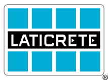

 

 

# MyStrataHeat Homebridge Plugin

This is the unofficial Homebridge plugin for Laticrete MyStrataHeat and Warmup Wi-Fi thermostats. It connects your devices to Apple HomeKit, using the comprehensive Warmup API to automatically discover your thermostats, control heating modes, read multiple temperature probes, and log historical energy consumption natively in the Eve app.

## Features

- **Automatic Device Discovery** — Automatically detects all locations and thermostats attached to your account.
- **Multiple Temperature Probes** — Exposes the internal Air sensor and dual Floor sensors as standalone Apple Home accessories for advanced automations.
- **Primary Sensor Control** — Choose whether the main thermostat dial represents the Air or Floor temperature.
- **Smart Override Handling** — Automatically handles temporary target temperature holds without disrupting your overall thermostat schedule.
- **Eve Graphing History** — Comprehensive charting for your temperature changes, active heating cycles, and instantaneous/total power consumption using `fakegato-history`.
- **Homebridge 2.0 Ready** — Built from the ground up to support the latest Homebridge standards.

## Supported Devices

The plugin automatically maps Laticrete / Warmup thermostat capabilities to HomeKit accessories:

| Component | What's exposed in HomeKit |
|---|---|
| **Thermostat** | Target Temperature, Current Temperature, Heating State (Off/Heat/Auto) |
| **Air Sensor** | Ambient internal air temperature (Optional standalone sensor) |
| **Floor Sensor 1** | Primary wired floor temperature probe (Optional standalone sensor) |
| **Floor Sensor 2** | Secondary wired floor temperature probe (Optional standalone sensor) |
| **Eve History** | Thermostat target vs actual graphing, valve position, and energy consumption |

## Quick Start

1. **Install the plugin** in the Homebridge UI: search for `homebridge-mystrataheat` in the Plugins tab and click Install.
2. **Configure Credentials:** Open the plugin settings and enter the Email and Password you use for the MyStrataHeat app.
3. **Customize Sensors:** Toggle on any extra Floor/Air sensors you want to see, and enable Eve Logging if you use the Eve app.
4. **Restart Homebridge** — your thermostats will appear in HomeKit!

## Configuration

All configuration is done through the Homebridge UI graphical settings menu. 
Available options include setting the polling refresh interval, adjusting the default duration for temporary temperature overrides, toggling visibility for the physical probes, and enabling Eve history.

## Troubleshooting & Help

- **Bug reports and feature requests**: [GitHub Issues](https://github.com/grecine/homebridge-laticrete/issues)

## Acknowledgements

This plugin communicates with the Warmup cloud API, whose structure was mapped by the open-source community. Special thanks to the [ha-warmup](https://github.com/ha-warmup/warmup) project and its contributors for documenting the API, and to the earlier work by [@alyc100](https://github.com/alyc100) and [@alex0103](https://github.com/alex-0103) that got it all started.

## Disclaimer

This is an independent, community-driven, open-source project. It is not affiliated with, endorsed by, or supported by LATICRETE International, Inc., Warmup Plc, or any of their subsidiaries. All product names and trademarks are the property of their respective owners and are used here solely to describe the hardware this plugin connects to.

## Changelog

See [CHANGELOG.md](./CHANGELOG.md) for version history and detailed release notes.
